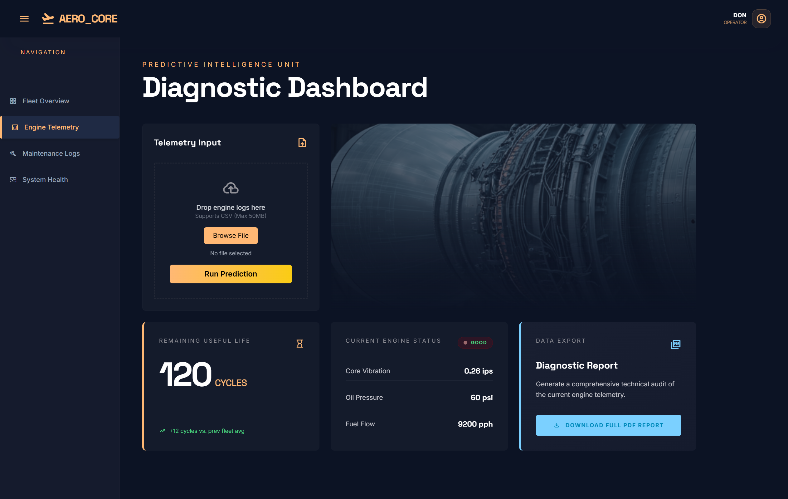
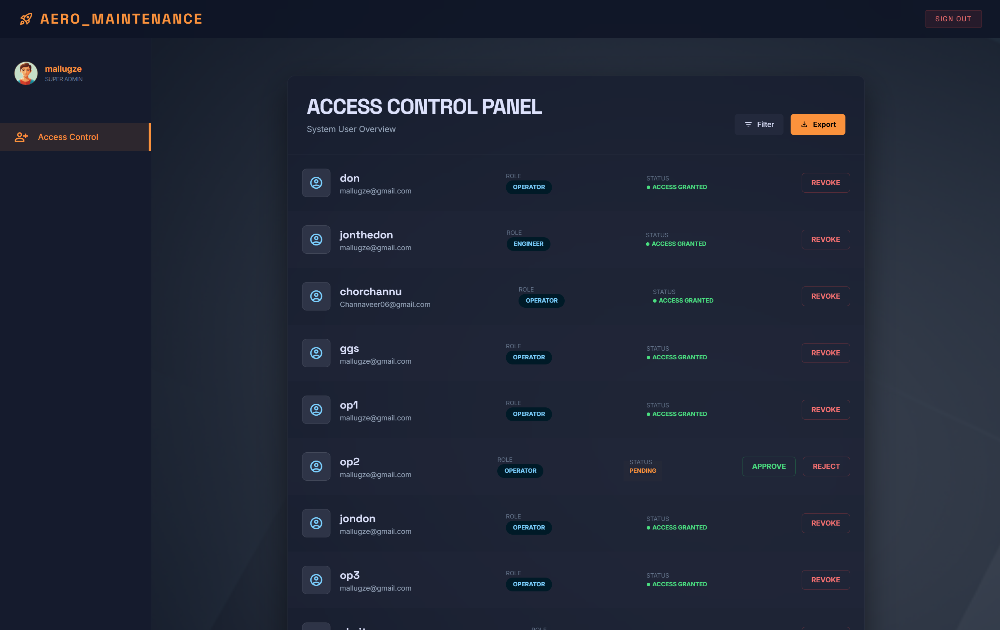
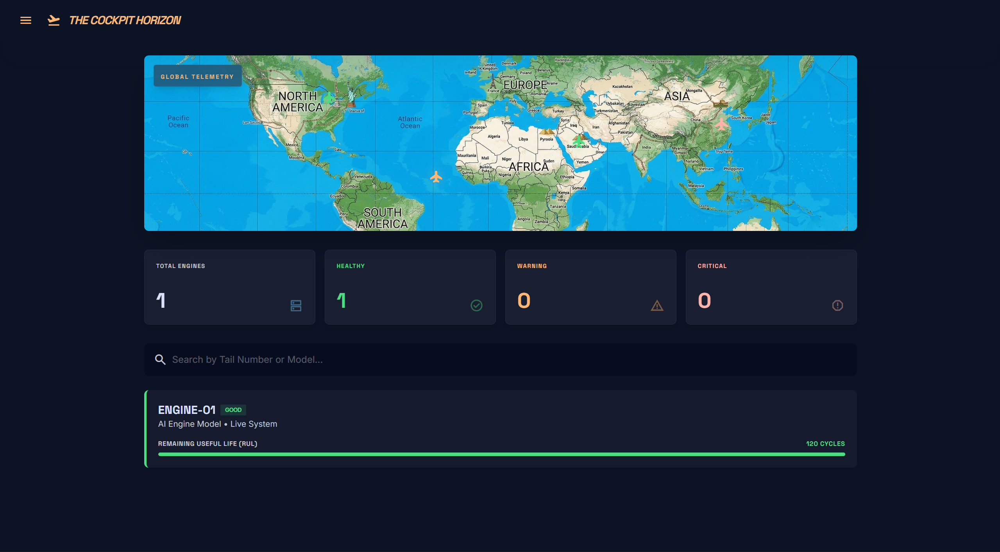

# 🚀 AeroCore – AI-Powered Telemetry Monitoring System

---

## 📸 Project Preview

### 🏠 Landing Page

### 📊 Diagnostic Dashboard

### 🔐 Admin Access Control Panel

### 🌍 Fleet / Telemetry Overview

---

## 📌 Overview

AeroCore is a full-stack AI-powered web application designed to simulate real-world aerospace telemetry monitoring systems.
It enables engineers to upload engine telemetry data and receive predictive diagnostics, including Remaining Useful Life (RUL) and system health metrics.

---

## 🧠 Key Features

### 🔐 Secure Authentication & Approval Workflow

* Custom Django authentication system
* Admin-controlled user approval
* SMTP email notifications (approval/rejection)

---

### 🤖 Predictive Engine

* ML-based `predict()` function
* Calculates RUL, vibration, fuel flow

---

### 📊 Interactive Dashboard

* Tailwind CSS glassmorphism UI
* Real-time feedback & dynamic rendering

---

### 📄 PDF Reporting

* Generated using ReportLab
* Downloadable technical diagnostic reports

---

## 🏗️ Architecture

---

## 🛠️ Tech Stack

* Python, Django
* TensorFlow / Keras
* NumPy, Pandas
* HTML, Tailwind CSS, JavaScript
* SQLite
* ReportLab
* SMTP Email

---

## 🚀 Workflow

1. User requests access
2. Admin approves via backend
3. User uploads telemetry data
4. ML processes data
5. Results displayed
6. PDF report generated

---

## 🔐 Security

* CSRF protection
* Session-based authentication
* Admin approval workflow

---

## 🚀 Future Scope

* REST API (Django REST Framework)
* Real-time streaming (IoT)
* Cloud deployment

---

## 👨‍💻 Author

Developed by **[Your Name]**

---

## ⭐ Show Your Support

Give a ⭐ if you like this project!
